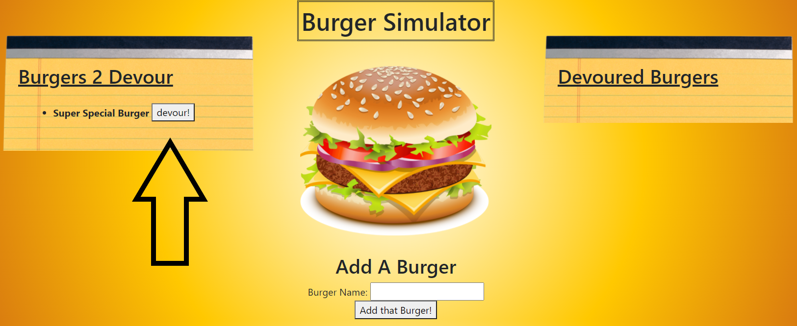

# Burger Simulator

## Overview:
The Burger Simulator is a simple dashboard that allows the user to eat burgers in an organized manner! The Burgers that are added via text box are saved in a remote database as either devoured or not devoured.  This was primarily accomplished using Javascript, Handlebars, and MySQL.  

### Table of Contents:
1. [How it works](#How-it-works)
2. [Example](#Example)
3. [Installation](#Installation)
4. [Contributing](#Contributing)
5. [Questions](#Questions)
6. [License](#License)

### How it works!
To use the app enter a burger name into the text box.  After you have entered your desired burger click the Add Burger button.  You will see the burger is now displayed on the left side of the screen in the Burgers 2 Devour Category.  Click the Devour button next to it and the burger will then disappear and reappear on the right side of the screen in the Devoured Burgers Category!

Add A Burger      Devour Burger      Be Satisfied      

### Example
Here is a link to the Burger Simulator:  [https://vfavorito-burger-simulator.herokuapp.com/](https://vfavorito-burger-simulator.herokuapp.com/)

### Installation
To run the code on your local machine you will need to have node.js and MySQL installed.  Then run the command npm i to install package files.  Run the schema file to create your local database.  Change the password in the connection.js file and you will be good to go!

### Contributing
If you would like to contribute to the development of this app the guidelines for doing so can be found here: [Contribution Covenant](https://www.contributor-covenant.org/version/2/0/code_of_conduct/code_of_conduct.txt)

### Questions?
Visit my Github profile here: [vfavorito](https://github.com/vfavorito) 
If you have any questions you can reach out to me at vince.favorito@gmail.com

### License
This App is covered under the MIT License